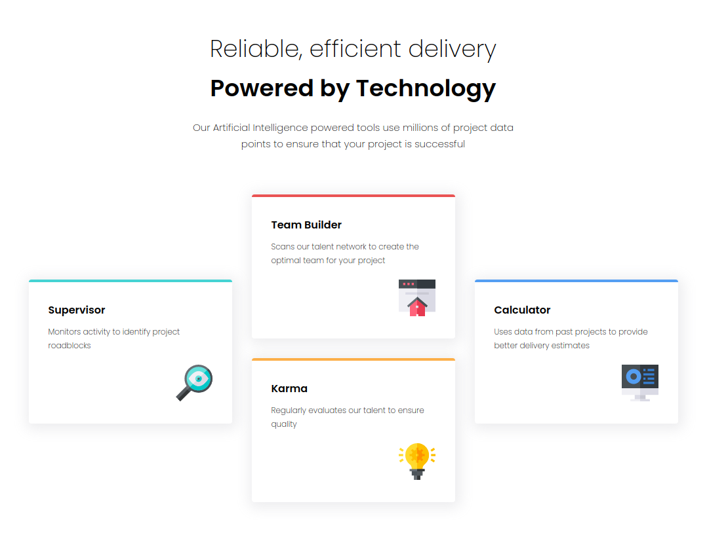

# Frontend Mentor - Four card feature section solution

This is a solution to the [Four card feature section challenge on Frontend Mentor](https://www.frontendmentor.io/challenges/four-card-feature-section-weK1eFYK). Frontend Mentor challenges help you improve your coding skills by building realistic projects. 

## Table of contents

- [Overview](#overview)
  - [The challenge](#the-challenge)
  - [Screenshot](#screenshot)
  - [Links](#links)
- [My process](#my-process)
  - [Built with](#built-with)
  - [What I learned](#what-i-learned)
  - [Continued development](#continued-development)
  - [Useful resources](#useful-resources)
- [Author](#author)
- [Acknowledgments](#acknowledgments)


## Overview

### The challenge

Users should be able to:

- View the optimal layout for the site depending on their device's screen size

### Screenshot



### Links

- Solution URL: https://github.com/toddteis/Four-card-feature-section
- Live Site URL: https://toddteis.github.io/Four-card-feature-section/

## My process

### Built with

- Semantic HTML5 markup
- CSS custom properties
- CSS Grid
- Flexbox
- Mobile-first workflow

### What I learned

This was my first use of CSS Grid. I really enjoyed the ease of layouting the site. I found using the grid-template-areas property really great for changing the layout with media query.

mobile first property:

```css
main {
      grid-template-areas:
      "sdl hd sdr"
      "sdl bd sdr"
      "sdl bd sdr"
      "sdl bd sdr"
      "sdl bd sdr";
}
```

@media only screen and (min-width: 1023px)

```css
main {}
        grid-template-areas:
          "sdl hd hd hd sdr"
          "sdl bdl bd bdr sdr"
          "sdl bdl bd bdr sdr";
}
```

### Continued development

I would like to continue using CSS Grid in future projects and become more familiar with its concepts and techniques.

### Useful resources

- https://www.youtube.com/watch?v=yMEjLBKyvEg by speaker Rachel Andrew - This CSS layout fundamentals workshop really helped understand CSS Grid basics.

## Author

- Website - https://www.toddteis.com
- Frontend Mentor - https://www.frontendmentor.io/profile/toddteis

## Acknowledgments

A big thank you to Frontend Mentor for providing a great learning tool.